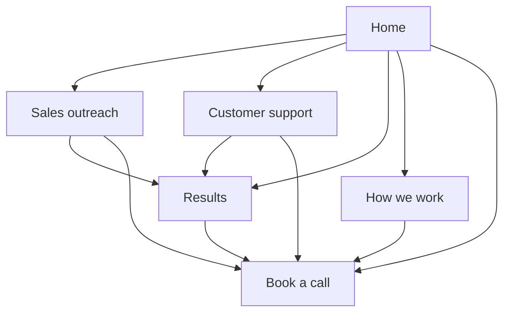

# Full website upgrade plan

Research checked: 2026-10-02. Status: six-page build and final design review complete; deployed preview verification in progress.

The next upgrade should turn the long homepage into a small, complete website. Keep the existing dark canvas, typography and purple accent. Give sales and support visitors separate explanations, demonstrations and evidence, with a clear route to booking.

## What the site needed before this upgrade

These are observations from the source and browser review before this upgrade, not analytics findings.

- The homepage carries both services, the full results ledger, the process, FAQs and booking. Service pages would give each audience a shorter, more relevant journey.
- Navigation mostly jumps down the homepage. It does not give either service a destination that can be shared directly.
- Proof is strong but dense: campaign rates, meeting counts and support outcomes compete for attention. Separate the overview from the explanation of how each figure was counted.
- The recent motion changes make examples quicker and clickable. The full upgrade should add useful choices and explanations, rather than more automatic animation.
- The static HTML uses homepage description, canonical and sharing tags. New pages need their own metadata and direct-load behavior.
- Both languages currently share the same URL and use a saved language choice. A complete language strategy needs explicit URLs if each translation is to be shared and indexed independently.
- There is no sitemap in the current public files. The new page structure needs one.
- We have no visitor behavior or booking conversion baseline. These recommendations are design hypotheses; they are not proof of higher conversion.

## The small toolkit worth using

| Resource | What it contributes | Use here |
|---|---|---|
| [Impeccable](https://github.com/pbakaus/impeccable) | Whole-interface design, structure, critique, responsive adaptation and motion guidance | Establish a consistent concept across all pages, then review the complete visitor journey |
| [Marketing Skills: site architecture](https://github.com/coreyhaines31/marketingskills/tree/main/skills/site-architecture) and [conversion review](https://github.com/coreyhaines31/marketingskills/tree/main/skills/cro) | Page hierarchy, navigation, internal links and review of messaging and calls to action | Design the service-to-proof-to-booking paths before writing components |
| [Web Quality Skills](https://github.com/addyosmani/web-quality-skills) | Reviews combining browser evidence and source inspection, covering speed, accessibility and search basics | Verify representative pages and important interactions, with equivalent measurements before and after |
| Figma plugin, optional | Editable design artifacts and a bridge between design and implementation | Useful if we want to compare mockups or hand the designs to another person |

The skill descriptions above are verified from their primary repositories. Their fit for this project is my recommendation, not a claim by the authors. The selected skills were installed at reviewed repository revisions after the full build was approved. The Figma plugin has been suggested in the app; connection is not confirmed.

Use the existing motion and animation performance skills alongside these. Adding several competing design skills would give us overlapping instructions. [Anthropic frontend design](https://github.com/anthropics/skills/tree/main/skills/frontend-design) is a lighter alternative to Impeccable; [Vercel web design guidelines](https://github.com/vercel-labs/agent-skills/tree/main/skills/web-design-guidelines) is an alternative finishing checklist. Neither requires changing the website framework.

Before adopting a downloaded skill, inspect its complete bundle and pin the reviewed version. Preserve project instructions over generic recommendations. Keep optional integrations outside the build unless they solve a concrete requirement.

## Six core pages with a job each

These are proposed destinations. Privacy, terms, contact behavior and old homepage links remain supported.

| Page | Proposed URL | What the visitor should understand | Main action |
|---|---|---|---|
| Home | `/` | What FlowSync does, which service fits, and why it deserves a closer look | Choose a service or book a call |
| Sales outreach | `/sales-outreach` | Who it fits, how cold email and replies work, and where a person stays in control | Book a sales discussion |
| Customer support | `/customer-support` | What the assistant can answer or do, and how it hands over to the team | Book a support discussion |
| Results | `/results` | What actually happened, during which period, and what each metric means | Explore relevant evidence, then book |
| How we work | `/how-we-work` | The first call, preparation, approval before launch and ongoing operation; who is responsible | Book an introductory call |
| Book a call | `/contact` | What the call covers, how long it takes, and how to send a message instead | Open the calendar or send a message |

Reuse `/contact` for booking rather than create a duplicate `/book` page. Preserve `/privacy`, `/terms` and the not-found page. Keep old `/#systems`, `/#results`, `/#process`, `/#faq` and `/#book` entry points useful through short homepage sections or deliberate compatibility handling.

Header: Sales outreach, Customer support, Results, How we work, language choice, Book a call. Logo returns home. Use direct links and an obvious current-page state. On phones, keep the same destinations in the existing accessible menu.

Footer: both services, Results, How we work, Book a call, existing contact details, privacy and terms. Keep the existing legal identity visible on every page.

## What changes on each page

### Home becomes an introduction

- Keep the strong headline and one opening workflow moment. Explain the two outcomes in plain language.
- Give the services two distinct, descriptive links with a short explanation of who each is for.
- Show a small proof selection with its scope and a link to the complete Results page.
- Summarize the three-step process. Move the detailed explanation to How we work.
- Keep only questions that help visitors choose a service or decide to book. Put service questions on the relevant page.
- End with a compact invitation to book. Put the full calendar and message form on `/contact`.

### Sales outreach explains control

- Lead with the problem and the existing qualification criteria. Do not invent a guaranteed outcome.
- Explain the real chain: find relevant buyers, send personal cold emails, classify replies, approve replies by default, book calls.
- Reuse the interactive inbox example with approval and replay. Clearly label it as an illustration.
- Explain what is prepared before launch, what the customer approves and what their team handles.
- Show relevant cold-email campaign evidence and link to its counting notes. Historical LinkedIn results do not become a current LinkedIn service offer.
- Answer service-specific questions and link directly to booking.

### Customer support explains capability and handover

- Lead with customer questions on website chat and Instagram, the channels already supported.
- Show predefined illustrative scenarios for a question, an order or return, and an unresolved case handed over by ticket. Visitors choose which example to see.
- Explain that answers come from supplied information; order and return actions depend on the connected shop and agreed setup.
- Show the two existing anonymized shop examples with dates and measured chat outcomes. Keep time-saved figures labeled as estimates and maximums.
- Explain where the team takes over and what context it receives. Finish with booking and a message alternative.

### Results makes evidence easier to read

- Let visitors choose All, Sales outreach or Customer support using accessible controls.
- Lead with a few understandable outcomes, then show the relevant campaign or shop records.
- Put dates, channels, definitions, unreported values and limitations beside the figures they qualify.
- Keep comparisons between the same kind of metric. Do not compare platform reply rates with the market’s real-reply rate.
- Add expandable counting explanations. Use case-detail pages only when the existing source pack supports a useful narrative, not just a statistic.

### How we work builds confidence

- Expand the existing three-step process into what happens, what the visitor provides, and what they approve.
- Explain the distinct ongoing behavior of sales and support systems using the already approved product facts.
- Include a concise founder introduction using verified public information. A real portrait or longer biography is optional and must be supplied or verified, not invented.
- Keep a clear booking action. No unsupported credentials, client logos, testimonials or promises.

### Booking removes distractions

- Use the existing 30-minute agenda, time-zone information, calendar and message form.
- Keep calendar loading behind a click, with its existing privacy explanation and fallback link.
- Make the calendar action primary and the message option secondary.
- Check field errors, sending, success and retry states without creating real leads or bookings during tests.

## Design and motion direction

- Preserve the current colors and type. Make each page feel distinct through composition, useful illustrations and content, not a new theme.
- Use fewer, clearer blocks on the homepage; give detailed pages stronger reading rhythm and relevant proof.
- Keep feedback quick. Animate a selected example, an answer opening or an approval result because the visitor did something.
- Keep the opening moment on Home. Interior pages should let visitors start reading immediately.
- Use transforms and opacity where appropriate. Avoid scroll locks, repeated entrance effects, decorative looping motion and fake controls.
- Respect reduced motion, keyboard operation, visible focus and touch. Illustrative controls never send real messages.

## Delivery decisions and checks

Reuse React, the existing router, language helper, motion helper, styles, examples, form and calendar. No framework migration or new CMS is required for these pages.

For independently shareable translations, the recommended target is `/en/...` and `/it/...`, with existing unprefixed URLs preserved as entry points. This is a proposed routing change, not current behavior. It must be included in the agreed build scope. The language switch should preserve the equivalent page and produce the expected URL.

Each public page needs its own title, description, canonical and sharing tags. Add language alternates only once language URLs exist. Inspect direct HTTP responses as well as the rendered browser page; changing a browser title alone does not fix link previews. Choose the smallest static-rendering or prerendering approach that works with the current Vite build, and verify it before committing to a dependency. Do not describe metadata injection alone as prerendered page content.

No page count or search checklist guarantees traffic or bookings. A later conversion comparison needs real, consistently defined visitor and booking data. Do not add analytics, cookies or session-recording tools as a side effect of this redesign.

## Reusable prompts

### Plan the visitor journey

> Read the project instructions, existing English and Italian copy, and dated result sources. Design a six-page FlowSync website: Home, Sales outreach, Customer support, Results, How we work, and Book a call using the existing contact route. For each page, define the visitor’s question, supported answer, useful proof, primary action and next destination. Preserve existing URLs and list any routing changes explicitly. Do not invent services, statistics, customer names, prices or promises. Return the sitemap, navigation, section order and a content inventory before implementation.

### Design the complete website

> Keep the existing FlowSync colors, fonts and visual identity. Design a complete website from the agreed page brief, rather than stretching the homepage into several copies. Give each service a distinctive composition, a useful interactive illustration and relevant proof. Keep the homepage concise and interior pages immediately readable. Use responsive layouts without clipped text or fixed-height content boxes. Explain any missing factual inputs. Produce complete desktop and mobile designs before a bounded review pass.

### Build with the existing stack

> Implement the agreed multi-page brief using the current React, Vite, router, language and motion helpers. Reuse the existing form, calendar and accessible menu. Keep English and Italian equally complete. Maintain old links, direct-page loading and browser back/forward behavior. Include route-specific metadata, a sitemap and the agreed language URL behavior. Add purposeful controls with immediate feedback, preserve reduced motion and keep the calendar behind a click. Do not migrate frameworks or add dependencies unless the current tools cannot meet a concrete requirement. Deliver a preview and draft PR; production merge needs the owner’s approval.

### Verify the complete journey

> Review Home to service to relevant Results to booking on desktop and mobile, in both languages. Inspect actual rendered states and source together. Check direct URLs, reloads, browser navigation, current-page indicators, language switching, keyboard focus, menu closure, interactive examples, reduced motion, form errors and calendar fallback. Verify metadata in initial responses. Run the existing build, lint, API and layout checks, extending layout coverage to all new pages. Measure representative pages under equivalent isolated conditions, aiming for the existing mobile Lighthouse performance requirement of at least 90. Report verified defects separately from hypotheses; do not claim conversion gains from an audit score.

## Persistent checklist

- [x] Inspect the existing page structure, navigation, proof, booking and metadata.
- [x] Research primary skill repositories and check the relevant skill files.
- [x] Suggest the optional Figma plugin without treating it as installed.
- [x] Define the proposed pages, navigation, content, motion direction and prompt pack.
- [x] Resolve the current chat choice: full build approved.
- [x] Review and adopt the selected skill bundles; preserve the approved structure and use /en and /it routes.
- [x] Implement the complete page structure and both languages.
- [x] Verify journeys, metadata, responsiveness, accessibility and performance.
- [ ] Publish a draft PR and inspect the deployed preview.
- [ ] Obtain the owner’s OK before merging to production.

The upgrade builds on the pending motion improvements. Production merge still requires the owner’s OK.

## Implemented behavior

- Six core pages: Home, Sales outreach, Customer support, Results, How we work and Book a call at the existing contact route. Legal pages remain available.
- Complete `/en` and `/it` versions. The language switch preserves the page, result filter and section link. Old unprefixed URLs and home section links still work.
- The homepage has concise service, proof and process summaries. Detailed interactive examples and the full dated results live on the appropriate pages.
- Support has three selectable illustrative conversations. Sales retains keyboard approval and replay. Results filters can be shared through their URL and restored with Back.
- Static page content and individual metadata ship in the initial response, including language alternates and the sitemap. Route code loads separately; opening a page keeps its content visible while the code loads.
- The contact page leads with the calendar, with a message option that preserves drafts. The calendar still loads only on a click. The unused home booking animation and WebGL dot field were removed.
- No new website dependencies, analytics, third-party tracking, factual claims, testimonials or founder imagery were added. Lead API behavior and legal copy are preserved.

## Validation on 2026-10-02

- Build and lint passed; all 40 API tests passed without network requests.
- The journey check covers initial HTML content and metadata, handler readiness, URL languages and reload, navigation focus, menu closure and inert background, examples, Results filters and browser history, form error/retry/success, and calendar fallback. Form responses are stubbed and external requests are blocked.
- The example check passes with normal and reduced motion, including keyboard approval, approval during replay and the absence of writes.
- All 252 layout runs passed: six pages, 19 screen sizes in both languages, and two reduced-motion sizes in both languages. The check also detects clipped headline masks. A separate resize check covers height-only headline changes.
- The Impeccable detector ran once on the changed source and returned no findings. This is a pattern check, not proof that every design or accessibility issue is absent.

### Mobile performance lab

Measured sequentially on the local production build, on English routes, with other browser checks stopped. Default Lighthouse mobile simulation and throttling; these are lab measurements, not visitor data or conversion results.

| Page | Performance | Accessibility | Best practices | SEO | Largest contentful paint | Total blocking time | Layout shift |
|---|---:|---:|---:|---:|---:|---:|---:|
| Home, run 1 | 95 | 100 | 100 | 100 | 2.41 s | 6 ms | 0.002 |
| Home, run 2 | 95 | 100 | 100 | 100 | 2.42 s | 0 ms | 0.000 |
| Home, run 3 | 95 | 100 | 100 | 100 | 2.42 s | 0 ms | 0.000 |
| Sales outreach | 94 | 100 | 100 | 100 | 2.58 s | 0 ms | 0.035 |
| Customer support | 94 | 100 | 100 | 100 | 2.58 s | 0 ms | 0.002 |
| Results | 95 | 100 | 100 | 100 | 2.52 s | 12 ms | 0.002 |
| How we work | 95 | 100 | 100 | 100 | 2.50 s | 0 ms | 0.003 |
| Booking | 95 | 100 | 100 | 100 | 2.50 s | 0 ms | 0.001 |

Initial Home performance median: 95, range: 95–95. Each page's initial measurement exceeds the project's 90-point mobile requirement. After the desktop resize correction, one Home confirmation returned 83 with 420 ms blocking time. Three consecutive final-build confirmations returned 92, 96 and 94 (median 94; range 92–96). Their blocking times were 160, 20 and 10 ms. This variability is retained in the record; lab scores do not guarantee individual visitor speed. Automated accessibility scores do not replace keyboard and reduced-motion checks.

### Final design review

A fresh Impeccable reviewer completed the full five-section finish contract and returned **ship** after one correction: mobile campaign records now show the existing localized “not reported” wording for missing figures. The journey check covers both kinds of missing figure and the expanded record at 320 px. Native desktop captures confirmed the service FAQ rows, resolving missing paint in optional full-page captures.

The review used desktop 1440×900 and phone 390×844 CSS viewports for all six page openings, with additional content and interaction views. Native screenshots crop the browser content area to 1425×891 and 375×812; they do not rescale the layout. The reviewer preserved the incumbent design rules, labeled illustrations, dated figures and calendar privacy boundary.

A fresh documentation handoff reconciled the built pages against the project palette, type, layout, components and product facts. It confirmed an ordinary extension of the existing system and made no design-system changes. The pre-existing absence of DESIGN.md, language abbreviations and older conflicting motion instructions were recorded without unsolicited repair.
